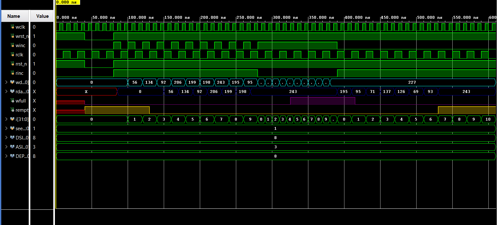

# ⚡ Asynchronous FIFO Design using Verilog


---

## 📌 Project Overview

This project implements a fully functional **Asynchronous FIFO** in Verilog HDL with parameterized **Data Width (DSIZE=8)** and **Address Size (ASIZE=4)**, giving a FIFO depth of **16 locations**. It safely transfers data between two independent clock domains using **Gray code pointer synchronization** to prevent metastability — a key technique used in modern SoC and VLSI design.

---

## 🗂 Module Architecture

| Module | Description |
|--------|-------------|
| `FIFO.v` | Top-level module — instantiates all submodules |
| `FIFO_memory.v` | Dual-port RAM memory array |
| `wptr_full.v` | Write pointer + FIFO full flag logic (Gray code) |
| `rptr_empty.v` | Read pointer + FIFO empty flag logic (Gray code) |
| `sync_w2r.v` | Write→Read clock domain pointer synchronizer (2-FF) |
| `sync_r2w.v` | Read→Write clock domain pointer synchronizer (2-FF) |
| `FIFO_tb.v` | Testbench — verifies all functional scenarios |

---

## 🔌 Top-Level Port Description

| Port | Direction | Width | Description |
|------|-----------|-------|-------------|
| wclk | Input | 1-bit | Write clock domain |
| rclk | Input | 1-bit | Read clock domain |
| wrst_n | Input | 1-bit | Active-low write reset |
| rrst_n | Input | 1-bit | Active-low read reset |
| winc | Input | 1-bit | Write increment (enable) |
| rinc | Input | 1-bit | Read increment (enable) |
| wdata | Input | DSIZE | Write data input |
| rdata | Output | DSIZE | Read data output |
| wfull | Output | 1-bit | FIFO full flag |
| rempty | Output | 1-bit | FIFO empty flag |

---

## ✨ Features

- ✅ Parameterized: DSIZE=8 bits, ASIZE=4 → depth of 16 locations
- ✅ Dual independent clock domains (wclk & rclk)
- ✅ Gray code pointers for safe Clock Domain Crossing (CDC)
- ✅ 2-FF synchronizers for metastability prevention
- ✅ Active-low asynchronous reset for both clock domains
- ✅ wfull & rempty status flags
- ✅ Verified with testbench in Xilinx Vivado

---

## 📁 File Structure

```
async-fifo/
├── FIFO.v            ← Top-level module
├── FIFO_memory.v     ← Dual-port RAM
├── wptr_full.v       ← Write pointer & full flag
├── rptr_empty.v      ← Read pointer & empty flag
├── sync_w2r.v        ← Write-to-Read synchronizer
├── sync_r2w.v        ← Read-to-Write synchronizer
├── FIFO_tb.v         ← Testbench
├── waveform.png      ← Simulation waveform
└── README.md
```

---

## 📊 Simulation Waveform



> Waveform shows wclk, rclk, winc, rinc, wdata, rdata, wfull and rempty signals verified in Xilinx Vivado Simulator.

---

## 🎓 Learning Outcome

- Mastered Clock Domain Crossing (CDC) in digital design
- Implemented Gray code pointer technique to avoid metastability
- Designed 2-FF synchronizers for safe signal transfer between domains
- Built parameterized dual-port memory for FIFO storage
- Verified full/empty flag logic through comprehensive simulation

---

## 👨‍💻 Author

**Arshad Ansari**  
M.Tech ECE (VLSI Design) — NIT Hamirpur  
[](https://www.linkedin.com/in/arshadansari04/)
    
